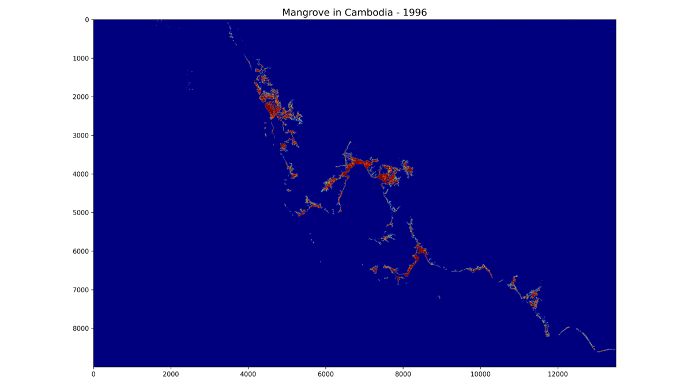
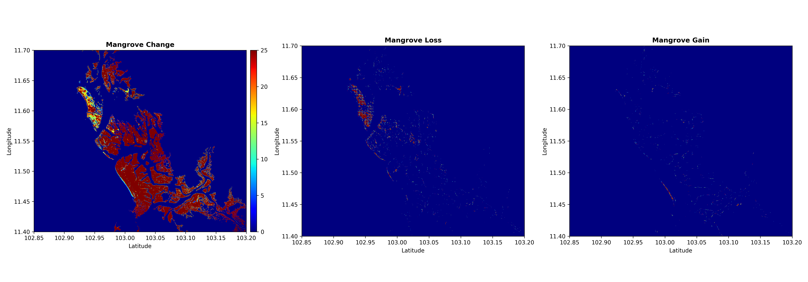

# Mangrove in Cambodia from 1996 to 2020

These data are retrieved from the dataset of the Global Mangrove Watch (GMW) version 3.0.

  

The yealy mangrove dataset in Cambodia were used to calculate Mangrove Existence or Changing Period, Loss and Gain from 1996 to 2020 by using the Python script: `Mangrove in Cambodia.ipynb`.

  

:star: **Please put a Star on it, if you like my repository! Thank you**

### Download dataset of Mangrove in Cambodia

- [mangrove_1996_2020.zip](https://github.com/menvuthy/Mangrove-in-Cambodia/raw/main/dataset/mangrove_1996_2020.zip)
- [mangrove_existence_period.zip](https://github.com/menvuthy/Mangrove-in-Cambodia/raw/main/dataset/mangrove_existence_period.zip)
- [mangrove_loss_gain.zip](https://github.com/menvuthy/Mangrove-in-Cambodia/raw/main/dataset/mangrove_loss_gain.zip)

### Global Mangrove Watch (1996 - 2020) Version 3.0 Dataset
 *Bunting, Pete;  Rosenqvist, Ake;  Hilarides, Lammert;  Lucas, Richard;  Thomas, Nathan;  Tadono , Takeo;  Worthington, Thomas; Spalding , Mark;  Murray, Nicholas;  Rebelo, Lisa-Maria*

This study has used L-band Synthetic Aperture Radar (SAR) global mosaic datasets from the Japan Aerospace Exploration Agency (JAXA) for 11 epochs from 1996 to 2020 to develop a long-term time-series of global mangrove extent and change. The study used a map-to-image approach to change detection where the baseline map (GMW v2.5) was updated using thresholding and a contextual mangrove change mask. This approach was applied between all image-date pairs producing 10 maps for each epoch, which were summarised to produce the global mangrove time-series. The resulting mangrove extent maps had an estimated accuracy of 87.4 % (95th conf. int.: 86.2 - 88.6 %), although the accuracies of the individual gain and loss change classes were lower at 58.1 % (52.4 - 63.9 %) and 60.6 % (56.1 - 64.8 %), respectively. Sources of error included a mis-registration in the SAR mosaic datasets, which could only be partially corrected for, but also confusion in fragmented areas of mangroves, such as around aquaculture ponds. Overall, 152,604 km2 (133,996 - 176,910) of mangroves were identified for 1996, with this decreasing by -5,245 km2 (-13,587 - 3686) resulting in a total extent of 147,359 km2 (127,925 - 168,895) in 2020, and representing an estimated loss of 3.4 % over the 24-year time period. The Global Mangrove Watch Version 3.0 represents the most comprehensive record of global mangrove change achieved to date and is expected to support a wide range of activities, including the ongoing monitoring of the global coastal environment, defining and assessments of progress towards conservation targets, protected area planning and risk assessments of mangrove ecosystems worldwide.

The paper which goes along with this dataset is available at the following reference:

Bunting, P.; Rosenqvist, A.; Hilarides, L.; Lucas, R.M.; Thomas, T.; Tadono, T.; Worthington, T.A.; Spalding, M.; Murray, N.J.; Rebelo, L-M. Global Mangrove Extent Change 1996 – 2020: Global Mangrove Watch Version 3.0. Remote Sensing. 2022

  

